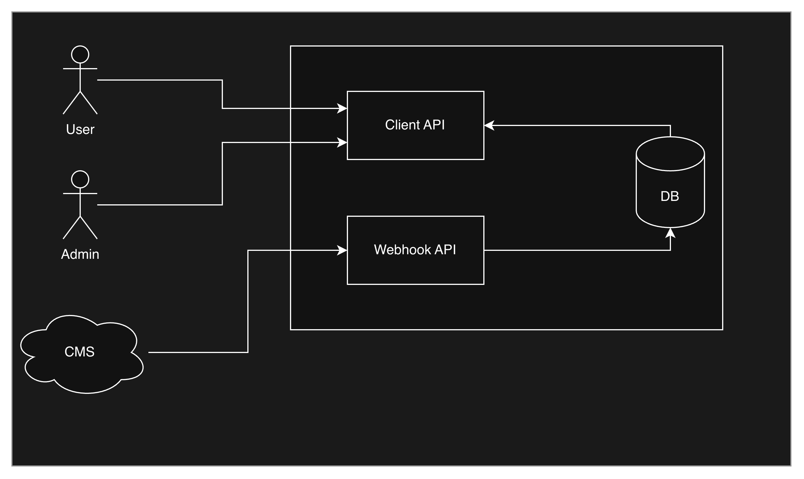

# Architecture

## Approach
In tandem with the KISS principle, the project is treated as if it will grow, so boundaries stay clean from the start: a clear separation of boundaries and domains within a Modular Monolith, following a Ports+Adapters and Clean architecture. Given that the initial requirements cover event handling and distinct flows (CMS vs Users), an Event-Driven architecture (not Event-Sourcing for now) with CQRS in place is the natural fit. Observability via logging and possibly OTEL is approached as soon as justified.

To get usable value as soon as possible, the visible API implementation comes first, with the inner domain and infrastructure (and possibly a simple UI) added later as needed.

## System Overview



The Queue-API-Exercise system exposes 2 REST APIs: a webhook for handling CMS entity-related events and one to handle Users and Admin Users requests. Because the project may grow, the cost of an initial scaffolding big-bang with boilerplate is paid up front: the solution is a modular monolith, ready to be split whenever necessary.

**Current implementation status:** the **CMS Webhook API** and the **Users API** are both fully implemented for v1 — shared auth, the `/cms/events` ingestion endpoint with asynchronous outbox processing into the entity store, the Users API's `/entities` read side and the administrator's enable/disable control, plus the `administrator`/`regular-user` seeding and the browser UI the Users API serves at its origin root (see below).

### Design decisions

The system's shape follows a small set of deliberate decisions, each justified by a business rule or a growth expectation:

- **Modular monolith, ready to split** — the solution starts as one deployable unit with clean boundaries, so a future split into services costs no re-architecture.
- **Event-driven processing with CQRS** — the webhook records events and responds immediately while a background worker applies them (the outbox model, see below); writes and reads are independent.
- **One shared store for both APIs** — the credential store and the entity store are each a single SQLite file both APIs address, which keeps auth and data consistent on one node; scaling out is explicitly deferred until the store moves off SQLite.
- **PBKDF2 credential hashing** — passwords are never stored in plaintext; only per-user salted PBKDF2 hashes live in the credential store.
- **No repository-marker walk** — deployments point the stores at a writable location via environment variables; nothing scans the filesystem for a solution file.

### Authentication & Authorization
Authentication is handled in the CMS Webhook API as Basic Auth (`username`+`password`) in all incoming requests. The mechanism is implemented once in the shared `QueueApi.Auth` library (`src/Shared/QueueApi.Auth`) so the Users API reuses the same scheme and store.

- `username` [10,20] characters in length, no other constraints. The reserved cms username is read from the `Auth:CmsUsername` configuration value (default `cms-webhook`) and the application fails to start if the configured value violates the length rule.
- Credentials are **not** hardcoded: they live in the shared SQLite credential store and are verified against a stored **PBKDF2 hash** (per-user random salt). Plaintext passwords are never persisted. The store is provisioned idempotently by `scripts/init-db.sh` (username and password passed as positional arguments); the API fails to start with a descriptive error if the store is unreachable or has not been initialized with the cms user.

> Note: `"cms-webhook"` is a special username reserved to be used by the CMS when connecting to the CMS Webhook API. It is the **only** username authorized to access the CMS Webhook API — valid credentials of any other user are rejected with `403`, all other failures with `401`. It is **not** valid for the Users API: valid `cms-webhook` credentials are rejected with `403` there too (the reserved username is read from `Auth:CmsUsername` in both APIs). `"administrator"` (configurable via `Auth:AdministratorUsername`) is the only user authorized to call the Users API's enable/disable endpoints and to see disabled entities; every other valid username is treated as a regular user. The three reserved users — `cms-webhook`, `administrator`, `regular-user` — are provisioned by `scripts/init-db.sh`.

> Note: no signature verification is provided in the current version. The channel is trusted by construction — the CMS is a single known client, and production traffic is protected by Basic Auth over TLS — so request signing (HMAC/JWT) is deferred until a second external client or an untrusted hop exists.

> Note: every endpoint requires Basic auth **except** the anonymous `/health` liveness probe and the `/openapi/v1.json` contract endpoint. Both are marked `.AllowAnonymous()` so load balancers, orchestrators, and clients can probe/discover them without credentials; every other endpoint still rejects anonymous requests with `401`.

### Persistence
Persistence uses `sqlite` relational databases accessed via **EF Core** (per the initial requirements). The engine is **selected by configuration**: every EF registration reads `Db:Provider` (default `sqlite`, the only wired implementation) through the shared switch in `src/Shared/QueueApi.Persistence/`, so swapping engines is a configuration value plus one switch branch and the provider package — no registration call-site change (see [Configuration](configuration.md)). SQLite keeps `EnsureCreated` startup schema creation; a real engine swap (e.g. PostgreSQL) additionally requires EF migrations, which is the documented precondition for such a change. Two independent stores exist, each configurable through its own `ConnectionStrings` value (e.g. via environment variables) so it can point elsewhere:

- **Implemented:** the shared credential store (`db/queue-auth.db`, `Users` table) holding username + PBKDF2 password hash per user, configured via `ConnectionStrings:AuthDb` and provisioned idempotently by `scripts/init-db.sh`.
- **Implemented:** the dedicated CMS database (`db/queue-cms.db`) holding the `cms_event_log` outbox and the `cms_entities` store, configured via `ConnectionStrings:CmsDb` and created automatically at startup (`EnsureCreated`, no init step). SQLite WAL journal mode and a busy timeout are enabled so the webhook's writes and the outbox worker's writes coexist on the single-writer file.

Relative `Data Source=` values resolve against the configured `Data:DbBasePath`, falling back to the application's content root — in local development the CmsWebhook project's content root is its own directory, so the stores land under `src/CmsWebhook/CmsWebhook.Api/db/`; the Users API points its own base path at that same directory (see its `appsettings.json`), so both APIs address the same two store files. Absolute and `:memory:` data sources are used as-is, and the resolved directory is created at startup when missing. There is **no repository-marker walk** (the `QueueApi.slnx` hunt is gone): a published deployment simply points `Data__DbBasePath` (or `ConnectionStrings__*`) at a writable location through environment variables — see [Configuration](configuration.md).

Caching is out of scope: the entity store is read by a single API on a single node, so the read path is cheap enough without a cache layer; a cache would add invalidation complexity for no measurable win at this scale.

### Performance
Per the initial requirements, the event-processing decision is documented and justified: processing is **asynchronous** — the webhook records events and responds `201` immediately, while a background worker applies them (see the outbox model below). The write side uses a single writer context. The Users API's read side uses a read-only/query-optimized EF configuration: its listing query runs `AsNoTracking` and the visibility commands use a single-writer tracking context. The listing returns each entity's full stored payload as a JSON string by design — payloads are not meant to be edited, so no endpoint accepts payload content — and the read representation intentionally differs from the recorded event's shape: the entity carries the maintained update timestamp and the administrator-visibility flag, which the accepted event did not. The outbox worker's pending sweep (`GetPendingAsync`) deliberately stays a **tracking** query (design decision, 2026-08-18): the per-event status advance reloads the row via `FindAsync`, which resolves from the change tracker without a database round trip, so adding `AsNoTracking` in isolation would cost one extra query per event. Revisit only when a sweep must handle many pending rows: switch the sweep to `AsNoTracking` and advance statuses with `ExecuteUpdateAsync` (single UPDATE, no load, joins the per-event transaction) — see the `spec-read-side-performance` change design for the full Option-2 sketch.

### Logging
Leveled console output (`Console` with explicit levels) is used; richer logging (e.g. Serilog) and OTEL remain TBD. Per the initial requirements' observability section, all processed events — including failing ones — are logged: processed events at Information, stale/duplicate events at Warning, failures at Error with their exception.

## CMS Webhook API - v1
The `/cms/events` endpoint, event types, validations and event processing below describe the **implemented** v1 behavior.

The **CMS Webhook API** is intended to be a _webhooks API_ so it needs a quick response to the external system that's _notifying_ it of already-happened events. All **CmsEvent**s received will be stored in a `cms_event_log` table.

> For the current **v1**, validations will be minimal. Whether **v2** will incorporate more complex validations in these endpoints or push this logic to async workers is TBD.

### `/cms/events` Request POST
Endpoint which handles the `POST` operation and expects the following **CmsRequest** as `json` object as body:
```json
{ "type": "eventType", "id": "entityId", "payload": {...}, "version": 1, "timestamp": "2024-01-01T00:00:00Z"}
```

> Note: All fields are required (not null and with a valid value), except `payload` and `version` which `delete` events omit (see the batch example below).

#### Fields:
- `id`: `string` entity's id.
- `payload`: `json` object which contains the actual data for the **CmsEntity** which needs to be fed into our system's DB. Payloads are stored as plain JSON text in the private CMS database — design decision: confidentiality is enforced by authentication and the private store (per the initial requirements); encryption-at-rest and a key vault are deferred until a real database engine is adopted.
- `type`: `string` operation performed upon the entity
- `timestamp`: `string` ISO 8601 (aka RFC 3339) date-time information of _when_ the event happened in the external CMS
- `version`: `int` version number coming from the external system; the first version of an entity is `1` (per the initial requirements)

> Note: Alternatively, the body may consist of an array of the same kind of objects, e.g.:
>```json
>[
> { "type": "publish", "id": "X", "payload": {...}, "version": 2, "timestamp": "2024-01-01T00:00:00Z"},
> { "type": "delete", "id": "Y", "timestamp": "2024-01-01T00:00:00Z" },
> { "type": "unPublish", "id": "Z", "payload": {...}, "version": 4, "timestamp": "2024-01-01T00:00:00Z"},
>]
>```

#### Event Types
- `publish` marks the **CmsEntity** as "published" and updates it
- `update` replaces the **CmsEntity**'s content with the newer details received without modifying the "published" flag
- `unPublish`: marks the **CmsEntity** as "not published" so it is no longer visible by any User, and updates its contents. It applies even when no prior `publish` event was received for that entity: per the initial requirements' corner case, the payload and version are still stored so the latest version is never lost from the database.
- `delete`: removes the **CmsEntity** by deleting it from the persistence layer

#### Validations
This endpoint acts as an Outbox, hence it validates and sanitizes only the base **CmsRequest** values (see [Sanitization](dsl_glossary.md)). Sanitization means accepted values are valid and safe to store: strings are non-empty, the `id` is trimmed, and each value is normalized to a canonical type before being persisted through parameterized queries. The `timestamp` must be an ISO 8601 / RFC 3339 date-time in the form of the requirements' example `2024-01-01T00:00:00Z` — ending in `Z` or a numeric UTC offset, with optional fractional seconds; date-only, culture-formatted and offset-less values are rejected with `400`. The `payload` object is checked to be a valid `json` key/value object and nothing else — its contents and format remain opaque and are never inspected. If these do not cause an error, the **CmsEvent** is recorded in the database and the endpoint returns `201` (Created), otherwise it returns `400`. A batch is all-or-nothing: if any event in the array is invalid, the whole batch is rejected with `400` and nothing is recorded.

#### Event processing
When **CmsEvent**s are processed, a number of scenarios may arise depending on the `id` (entityId), `version` (entity version) and `payload`'s contents. These include, but are not limited to, the following:

1. `publish`, `update` and `unPublish`, when they refer to an `id` of an object that doesn't exist, they create it.
2. `publish`, `update` and `unPublish`, when an event with the same `id`, `version` **and** `type` was already recorded in the DB, do nothing (idempotent handling of re-delivered events). An event of a different `type` for the same `id` and `version` is **not** a duplicate: e.g. a `publish` followed by an `unPublish` of the same version must still flip the entity to "not published", and vice versa.

  > Comparing the incoming `payload` with the already-existing entity, or checking the "is published" flag status, is intentionally simplified out of scope.
3. `delete`, when referring to an `id` of an object that doesn't exist, does nothing.
4. an event whose `version` is older than the entity's current stored version is ignored as stale (out-of-order delivery), so the stored entity always keeps the latest version.

> Note: `payload` is assumed to always be present for `publish`, `update` and `unPublish` events, as stated in the request definition (`delete` events omit it).

#### Outbox processing model
Events are processed **immediately but asynchronously** (design decision): after recording the **CmsEvent** with status `Pending`, the endpoint signals an in-process `CmsEventProcessorWorker` through a `System.Threading.Channels` fast-path; the worker also sweeps pending rows at startup and periodically, so events survive crashes and restarts. Each event is processed in its own transaction and advances to `Processed`, or to `Failed` with its error recorded (failed events are not retried automatically and are logged at Error; processing continues with the next event). Processing maintains the `cms_entities` store — the latest version, payload, published flag and the administrator-visibility flag the Users API reads. The upsert carries the stored visibility override forward, so a processed CMS event can never silently re-enable an entity the administrator disabled. The write side (ingest command + processing) lives in `CmsWebhook.Application`/`CmsWebhook.Infrastructure` following strict CQRS; the read side is the Users API module.

### Healthcheck
`GET /health` is an **anonymous liveness probe** returning `200 OK` with a JSON body (`{"status":"Healthy"}`) while the application is running, and `503 Service Unavailable` when unhealthy. It exists so load balancers and orchestrators can probe the API without credentials, and is the first endpoint exempt from the fallback authorization policy. It is implemented with the built-in `AddHealthChecks()` + `MapHealthChecks("/health")` and a small JSON response writer — liveness only, no deep or database checks (the app already fails fast at startup when either store is unreachable).

### OpenAPI contract
`GET /openapi/v1.json` serves an **OpenAPI document generated from the endpoint code at runtime** (`Microsoft.AspNetCore.OpenApi`), so the contract can never drift from the implementation — code is the source of truth. The endpoint is anonymous. The **Scalar** API reference UI (`Scalar.AspNetCore`) is mapped as the browsable Swagger replacement (`/scalar/v1`) and is **always-on — served in every environment**, anonymous like the raw contract it renders (it shows exactly the same public JSON; change `openapi-consumer-ui`). Endpoints are organized into per-feature classes (`Endpoints/HealthEndpoints.cs`, `Endpoints/CmsEventEndpoints.cs`) exposing `MapXxx(this IEndpointRouteBuilder)` extension methods, with `WithSummary`/`WithDescription`/`WithTag` metadata enriching the contract.

## Users API
> **Implemented:** `src/Users/Users.Api` (endpoints), `Users.Application` (query/command handlers) and `Users.Infrastructure` (its own `UsersDbContext` over the shared `cms_entities` table) — there is no `Users.Domain` project; the module reuses `CmsWebhook.Domain.CmsEntity` directly.

The **Users API** serves clients interested in their entities' data. It reads the same `cms_entities` store the CMS Webhook API writes, using the same shared credential store. Every endpoint requires Basic auth except the anonymous `/health` liveness probe, `/openapi/v1.json` and the always-on Scalar UI. The fallback policy admits any authenticated user **except** `cms-webhook` (reserved for the CMS Webhook API); the enable/disable commands additionally require the `administrator` username. Missing or invalid credentials yield `401`; a valid user without the required role yields `403`. The API fails to start when the store lacks the `administrator` user.

### Browser UI (served at the origin root)

The Users API hosts a **Blazor WebAssembly** client (`src/Users/Users.Web`) and serves it at its origin root (`/`) with the hosted-WASM pipeline: `UseBlazorFrameworkFiles()` serves the client's `_framework` assets and a `MapFallbackToFile("index.html")` fallback serves the shell for client-side routes, both **anonymous** — the static-file and fallback middleware run before the auth middleware, so the shell loads without credentials while every endpoint keeps its exact auth semantics. The UI calls the API's own endpoints **same-origin**, so no CORS is configured anywhere.

- **Sign-in** collects the same username/password the API authenticates against and attaches them as a Basic `Authorization` header on a same-origin `HttpClient`; credentials live only in memory for the session. `401`/`403` — including the reserved `cms-webhook` rejection — surface as an inline error.
- **Role is derived from the username**, exactly as the API derives it: the `administrator` sees the full table with a per-row enable/disable toggle backed by the existing `POST /entities/{id}/disable|enable` endpoints; every other user sees the same table **without** the toggle column.
- **No API change**: serving the UI is additive anonymous static-file serving only; every endpoint, auth policy, and the OpenAPI contract behave exactly as before.

### `/entities` GET
Returns a list of all currently published entities:
- A **regular user** only sees entities which have not been disabled by an administrator.
- The **administrator** sees all published entities, including disabled ones.

Unpublished entities are never returned, to any user.

#### Response
Each item carries the entity **id** and its **administrator-visibility flag** (so the administrator can discover which entities to enable/disable), alongside the version, update time and payload. The shape is uniform for both roles — a regular user only ever receives enabled items, so their flag is always `true`:

```json
[
    {
        "id": "entity-1",
        "isVisibleByAdmin": true,
        "latestVersion": 1,
        "updatedAt": "2024-01-01T00:00:00+00:00",
        "payload": {}
    }
]
```

### `/entities/{id}/disable` POST
Only accepts requests from the `administrator` user, and internally results in the "is visible" flag being disabled. Requires no request body, is idempotent (disabling an already-disabled entity still succeeds), returns `204 No Content` on success and `404 Not Found` for an unknown entity id. The route `id` is sanitized like the webhook's event ids: surrounding whitespace is trimmed before the lookup and an empty-or-whitespace-only id is rejected with `400` (see [Sanitization](dsl_glossary.md)).

### `/entities/{id}/enable` POST
Only accepts requests from the `administrator` user, and internally results in the "is visible" flag being enabled. Requires no request body, is idempotent, returns `204 No Content` on success and `404 Not Found` for an unknown entity id. The route `id` is sanitized like the webhook's event ids: surrounding whitespace is trimmed before the lookup and an empty-or-whitespace-only id is rejected with `400` (see [Sanitization](dsl_glossary.md)).

> Note: enabling and disabling the visibility is independent from publishing status and regular update operations performed on the entity, and the administrator's choice survives subsequent CMS events (the entity upsert preserves the flag).
