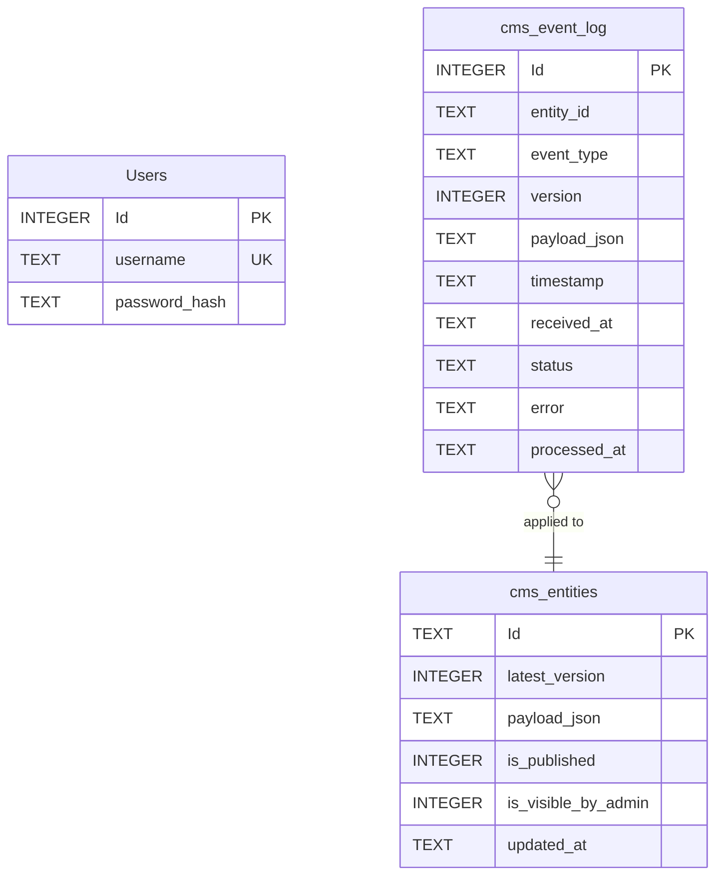

# Database Schema

**Source of truth.** This page transcribes the SQLite schema from the EF Core entity model — the `DbContext`/entity classes in `src/Shared/QueueApi.Auth`, `src/CmsWebhook/CmsWebhook.Infrastructure`, and `src/Users/Users.Infrastructure`. The schema is created at startup with `EnsureCreated`, which derives the real tables from those classes, so documenting the model *is* documenting the live schema. When an entity changes, update this page in the same change.

The system uses two independent SQLite stores:

- **Auth store** (`db/queue-auth.db`) — the shared credential store both APIs authenticate against.
- **CMS store** (`db/queue-cms.db`) — the outbox (`cms_event_log`) and the processed entity store (`cms_entities`), written by the CMS Webhook API and read by the Users API.

Both are addressed through `ConnectionStrings:*`; relative `Data Source=` paths resolve against `Data:DbBasePath` (falling back to the application's content root) — see [Configuration](configuration.md).

The `cms_event_log.entity_id` → `cms_entities.Id` link is a **logical** relationship applied by the outbox worker's upsert — no foreign-key constraint is declared in the EF model. `Users` lives in the separate auth store (`queue-auth.db`) and has no relationship to the CMS tables.

## Auth store — `Users`

One row per registered user. Credentials are never plaintext: `password_hash` stores the self-describing PBKDF2-HMAC-SHA256 encoding (`PBKDF2-SHA256$<iterations>$<base64 salt>$<base64 derived key>`, 100,000 iterations), so the per-user random salt travels inside the encoded value and there is no separate salt column.

| Column | Type | Nullable | Key | Description |
|---|---|---|---|---|
| `Id` | INTEGER | no | PK (auto) | Store primary key |
| `username` | TEXT | no | unique index | Unique username, 10–20 characters (column max length 20) |
| `password_hash` | TEXT | no | — | Encoded PBKDF2 hash with the salt embedded |

**Indexes:** unique index on `username`.

## CMS store

### `cms_event_log`

The outbox: one row per accepted CMS event, appended at ingest and mutated only by the outbox worker's status advance. `event_type` stores the `CmsEventType` name (`publish`, `update`, `unPublish`, `delete`) and `status` stores the `CmsEventStatus` name (`Pending`, `Processed`, `Failed`).

| Column | Type | Nullable | Key | Description |
|---|---|---|---|---|
| `Id` | INTEGER | no | PK (auto) | Event log primary key |
| `entity_id` | TEXT | no | — | External entity id the event refers to |
| `event_type` | TEXT | no | — | Operation name (max length 16) |
| `version` | INTEGER | yes | — | External version; null for `delete` |
| `payload_json` | TEXT | yes | — | Raw JSON payload; null for `delete` |
| `timestamp` | TEXT | no | — | When the event happened in the CMS (ISO 8601) |
| `received_at` | TEXT | no | — | When our system recorded the event |
| `status` | TEXT | no | — | `Pending` / `Processed` / `Failed` (max length 16) |
| `error` | TEXT | yes | — | Failure message when `status` is `Failed` |
| `processed_at` | TEXT | yes | — | When processing finished, success or failure |

**Indexes:** index on `status`.

### `cms_entities`

The processed entity store: the latest version, payload, published flag, and the administrator visibility override, read by the Users API. The primary key is the external entity id (provided by the CMS, not auto-generated). The placement of `is_visible_by_admin` is a documented design decision — see [Architecture](architecture.md).

| Column | Type | Nullable | Key | Description |
|---|---|---|---|---|
| `Id` | TEXT | no | PK | External entity id |
| `latest_version` | INTEGER | no | — | Latest version known to the system |
| `payload_json` | TEXT | no | — | Raw JSON payload of the latest version |
| `is_published` | INTEGER | no | — | Published flag (0/1) |
| `is_visible_by_admin` | INTEGER | no | — | Administrator visibility override (0/1, defaults to visible) |
| `updated_at` | TEXT | no | — | When the latest version was updated, from the event timestamp |

**Event → entity relationship.** `cms_entities` is the *processed* projection of the outbox: the worker applies each event to its entity row (upsert by `Id`), so an entity row holds the latest applied state rather than the raw event. The read representation therefore differs from the recorded event's shape — see [Architecture](architecture.md).

## Store configuration

- **Journaling:** SQLite WAL mode (`PRAGMA journal_mode=WAL`) is enabled at the CMS Webhook API's startup so the endpoint's writes and the outbox worker's writes coexist on the single-writer file.
- **Busy timeout:** `Default Timeout=30` in the CMS connection string (the appsettings default) gives concurrent writers room to retry.
- **Schema creation:** `EnsureCreated` creates the schema at startup (no migrations). The CMS Webhook API owns the CMS schema; the Users API's `UsersDbContext` maps the existing `cms_entities` table without creating it, so the two modules stay byte-for-byte aligned on the shared table.
- **Paths and engine:** see [Configuration](configuration.md) for the `ConnectionStrings:*` / `Data:DbBasePath` resolution rules and the `Db:Provider` engine switch.
